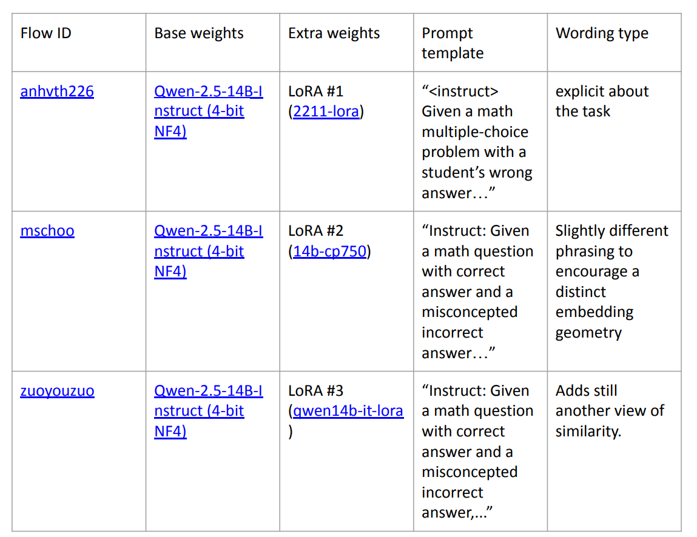

# Eedi – Mining Misconceptions in Mathematics

This repository contains my solution to the [Kaggle Eedi – Mining Misconceptions in Mathematics competition](https://www.kaggle.com/competitions/eedi-mining-misconceptions-in-mathematics).  
The goal of the competition was to **diagnose student misconceptions in mathematics**:  
given a multiple-choice question (MCQ), its correct answer, and a selected incorrect answer, the system must recommend **the top 25 most likely misconceptions** from a pool of 2.5k+.  

---

## 📘 Competition Overview

- **Task**: For each `(Question, Incorrect Answer)` pair, return a ranked list of 25 misconception IDs.  
- **Input**: CSV with questions, 4 answers, and the correct option.  
- **Output**: CSV with `QuestionId_Answer` and 25 misconception IDs separated by spaces.  
- **Evaluation metric**: MAP@25 (mean average precision over top 25).  

**Why is it hard?**
- >2,600 possible labels, very unbalanced distribution  
- High similarity between many misconceptions (subtle distinctions)  
- Need both **coverage** (not missing the correct label) and **precision** (ranking it high)  

---

## 🔍 Solution Overview

I implemented a **retrieve → rerank pipeline**:  
1. **Retriever(s)**: fast encoders to select top candidates.  
2. **Reranker**: large language model that refines ordering of top candidates.  

  

---

## ⚙️ Detailed Pipeline

### 1. Data Reshaping
- Each MCQ was flattened: every wrong answer became its own row.  
- Final dataset: `(Question + WrongAnswer)` pairs with target misconception ID.  

### 2. Embedding with Qwen Models
- Used **Qwen-14B** models as encoders (decoder-style LLMs repurposed).  
- Applied **LoRA adapters** with different templates → 3 independent “flows.”

  

- Concatenated embeddings (3 × 4096 = 12,288 dimensions).  
- Cosine similarity + KNN retrieved top-25 misconceptions.  

### 3. LoRA (Low-Rank Adaptation)
- Only small matrices (A, B) are trained instead of full weight updates.  
- Efficient in memory (MBs vs GBs).   

### 4. Initial Retrieval
- Top-25 candidates selected with brute-force cosine similarity.  
- Achieved ~90% recall@25, but poor fine ranking.  

### 5. Reranking with Qwen-32B (AWQ quantized)
- Quantization: **AWQ 4-bit** → fits on Kaggle GPUs.  
- Used `MultipleChoiceLogitsProcessor` to restrict logits only to valid outputs.  
- Prompt contained top-9 retrieved candidates.  
- Model outputs a digit (1–9), scores used for reordering.  
- Limitation: cannot go beyond 9 (multi-digit tokenization issue).  
  - *Possible fix*: use letters `A–Y` for 25-way classification.  

---

## 📊 Results

- Final score: **MAP@25 = 0.48353 (Private Score) / 0.51102 (Public Score)**  
- ~Top 100 position on the leaderboard.  

---

## 🚀 Possible Improvements

- Rerank all 25 with **letters A–Y** instead of digits.  
- Enable all 3 flows (currently optional).  
- Fine-tune a **14B cross-encoder reranker**.  
- Hard-negative mining for retrievers.  
- Add embeddings from other open models (e.g. `gte-base`, `bge-large`).  
- Generate **synthetic MCQs** with LLMs + filter with “LLM-as-judge.” 
- Multi-stage rerank pipeline (14B → 32B → 72B).  
- Distill **Chain-of-Thought reasoning** into retriever/reranker prompts.  

---

## ❌ What Didn’t Work

- Finetuning **Salesforce/SFR-Embedding-2_R** for retrieval.  
- Using multiple Qwen-1.5B LoRAs in ensemble (weaker than one 14B).  
- Synthetic and paraphrased dataset without careful curation (added noise).  
- Iterative hard-negative mining → no gain in recall.  

---

## 🔗 Resources

- 📑 [Presentation slides (PDF)](Eedi_Misconceptions_Presentation2.pptx.pdf)  
- 📘 [Competition + SOTA literature review](Mining_Misconceptions_in_Mathematics.pdf)  
- 📓 [Kaggle notebook with code](https://www.kaggle.com/code/iosifcovasan/eedi-retrieve-rerank)

---

## 🙌 Acknowledgements

- Thanks to the Kaggle community for discussions and shared ideas.  
---
